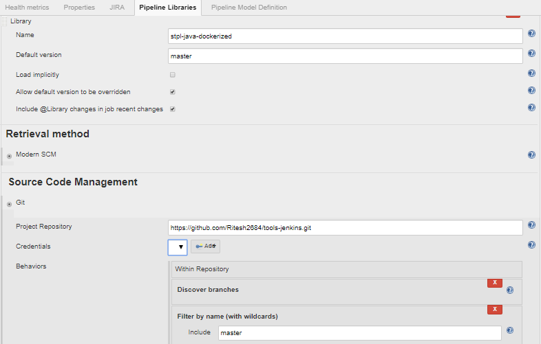

# Pipeline Assignment

## Part 1

Write a Jenkins job which would be suitable for building a Maven project in an enterprise banking environment. The job should enforce industry coding style standards, be secure, tested and published to a private maven repository.

You can assume you have an up-to-date instance of Jenkins and are free to use any plugins you want.

In cases where you require any external services, feel free to comment them out explaining what they do. A limited amount of psuedo-code is acceptable.

## Solution

As a solution to Part 1, I have created a jenkins pipeline script to build the component as docker image and push to docker repository with the required steps in the pipeline i.e. code checkout, build, run tests, execute validations, security checks, tag & push. 

## Tools used

Git : Code repository
Maven : To build the application
SonarQube : Code Quality Standards validation
Nexus IQ : monitoring of open source libraries vulnerabilities in the application.
HP Fortify : To scan the application for security vulnerabilities
Docker Lint : For standards validation of Docker file
Twistlock : Tool used for Container Security i.e image scan and dynamic container scanning for vulnerabilities. Other tools Nexus IQ, Anchore, Aquasec
Docker : For converting the application build into an image, tag and push the image.
Nexus3 : As artifact management for Docker Images
Jenkins : For execution of Pipeline build
Slack : For Notification

### Steps Executed to prepare the solution

1) Executed the given maven command, to generate and build 'my-app' application

`mvn archetype:generate -DgroupId=com.mycompany.app -DartifactId=my-app -DarchetypeArtifactId=maven-archetype-quickstart -DarchetypeVersion=1.4 -DinteractiveMode=false`

2) Added the application to github, to take it as a reference to build the component. Please find the link,
`https://github.com/Ritesh2684/my-app.git`

3) Added a docker file to the application, so that it could be build as a docker image.

3) Created the jenkins pipeline script refer to jenkinsfile present in the repository. This file could be used within Jenkins pipeline Job to build the specified application.

4) Steps executed in the Jenkins file 
        - Slack Notificaion for start of the pipeline
        - Code Checkout from github
        - prepare settings.xml
        - Build and execute test cases using Maven
        - Static Code analysis using Nexus IQ and SonarQube
        - Scan for security violations using HPFortify
        - Syntax check of docker file using docker lint
        - build image using Docker
        - Container security scan using Twistlock
        - Execution of Smoke test cases
        - Tag and push docker image
        - Slack Notification for status update of the job.
        
## Part 2

People love your new Jenkins job and have started copying parts of it to their own projects. You continue to enhance the original job with improvements but after a few months there are dozens of variations of your original job. You need a better way to manage this shared functionality so people are always able to use the latest version of your work. What do you do? Include some code examples.

## Solution

As a solution to Part 2, Pipeline scripts should be maintained in scm repository ( Github, bitbucket etc ) and included in the Jenkins environment as Pipeline Library. All project should use the Library instead of making a copy of our beloved Jenkins job.

As a reference, I have added a 

        
        
        

